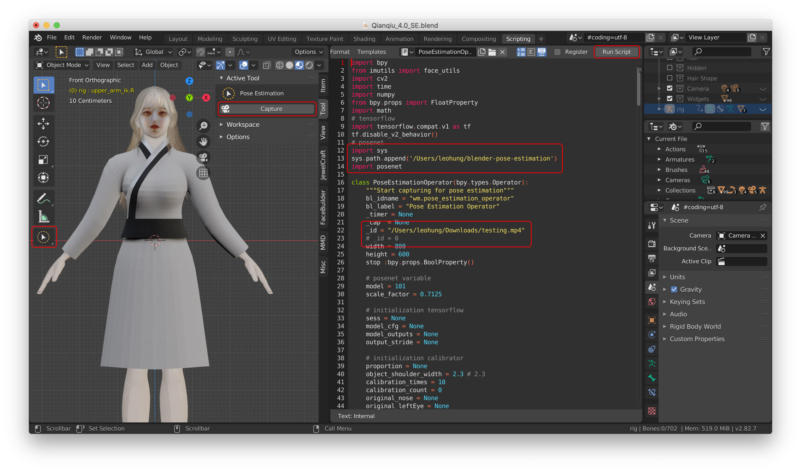

# blender-pose-estimation (under development)
Real-time camera capture pose estimation in Blender. Use TensorFlow Posenet for real-time capture and real-time update of Blender 3D model poses to easily complete animation.

# Demo


# Install
## MacOS
- Run in Blender Scripting
```python
# Import sys and use sys.path to get Blender's default python path
import sys
sys.path
# Find the path from the output, something like that
/Applications/Blender.app/Contents/Resources/2.82/python/bin/python3.7m
```
- Run in Terminal
```bash
# Go to the default python directory of Blender, something like that
cd /Applications/Blender.app/Contents/Resources/2.82/python/
# Use Blender's default python to install, something like that
./python3.7m -m ensurepip
./python3.7m -m pip install --upgrade pip --user
./python3.7m -m pip install opencv-python opencv-contrib-python imutils numpy tensorflow pyyaml --user
```

# Usage
1. Clone this project to your computer.
```
git clone https://github.com/srleohung/blender-pose-estimation
```

2. Copy PoseEstimationPanel.py and PoseEstimationOperator.py to your Blender Scripting.

3. Change PoseEstimationOperator.py library path and config.
- Change to step 1 blender-pose-estimation directory path
```python
sys.path.append('/Users/leohung/blender-pose-estimation') # something like that
```
- Change _id to your camera id or your video path
```python
# Capture from video
_id = "/Users/leohung/Downloads/testing.mp4" # something like that
# Capture from camera
_id = 0 # something like that
```

4. Use add-on "Rigging: Rigify" to create Human(Meta-Rig) and generate rig.
- How to use the add-on "Rigging: Rigify" and generate rig ?
https://github.com/srleohung/allinone/blob/master/blender/notes.md

5. Click "Run Script" to run PoseEstimationPanel.py and PoseEstimationOperator.py.

6. Click "Capture" to start.



# Find Collaborator
I would like to find collaborators to join to complete this project. I am not good at calculating 3D coordinates and angles. So, I would like to find collaborators who can discuss and learn from each other.

- Email: srleohung@gmail.com

- About me: https://leohung.herokuapp.com/

# Version Issue
- 3D model movement jitter

- Calculate 3D coordinates and angles error

- Need to get the initial value of the 3D model from the camera

# Possible Future Work
- Second camera captures the position of human movement

# References
- [posenet-python](https://github.com/rwightman/posenet-python)

- [FacialMotionCapture](https://github.com/jkirsons/FacialMotionCapture)